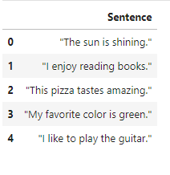

# Topsis Analysis on Text Generation Models

### The model aims at ranking various text generation pre-trained models in terms of their text generation abilities based on various paramters using Topsis algorithm for multi-criteria-decision-making. Following parameters have been used for describing the models -

#### 1. Perplexity:

A measure of how well a language model predicts a sample of text. Lower perplexity indicates better performance.

#### 2. ROUGE score:

Evaluates the quality of generated text by comparing it to one or more reference texts. Higher BLEU scores indicate better performance.

#### 3. BLEU score:

Measures the overlap of n-grams and word sequences between generated text and reference text, commonly used in summarization tasks.

### Following pre-trained models have been taken into consideration:-

- #### [GPT2](https://huggingface.co/openai-community/gpt2)

- #### [distilGPT2](https://huggingface.co/distilbert/distilgpt2)

- #### [GPT2-medium](https://huggingface.co/openai-community/gpt2-medium)

- #### [GPT2-large](https://huggingface.co/openai-community/gpt2-large)

### Dataset desciption -

## On testing the models on the above dataset, following estimates for the parameters were obtained-

| Models | Perplexity | BLEU | ROGUE |
|----------|----------|----------|----------|
| GPT2 | 18263.198 | 8.78776e-233 | 1.0 |
| distilGPT2 | 9102.0738 | 8.78776e-233 | 1.0 |
| GPT2-medium | 19878.612 | 8.78776e-233 | 1.0 |
| GPT2-large | 26192.336 | 8.78776e-233 | 1.0 |

### Perplexity:-

### ROUGE score:-

### BLEU score:-

## Topsis analysis of the models yielded the following results -

| Models | Perplexity | BLEU | ROUGE | Topsis Score | Rank |
|----------|----------|----------|----------|----------| -----|
| GPT2 | 0.471933 | inf | 0.5 | 0.463956 | 2 |
| distilGPT2 | 0.235204 | inf | 0.5 | 1.000000 | 1 |
| GPT2-medium | 0.513676 | inf | 0.5 | 0.369434 | 3 |
| GPT2-large | 0.676827 | inf | 0.5 | 0.000000 | 4 |

From the model rankings obtained from the above analysis, it is clear that 'distilgpt2' is the best performing model out of the 4 models considered.
